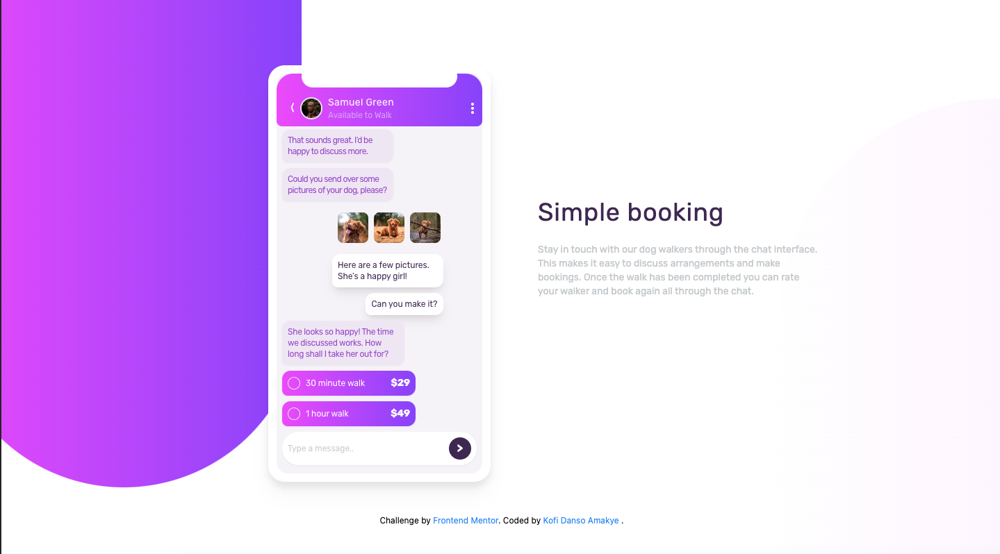

# Frontend Mentor - Chat app CSS illustration solution

This is a solution to the [Chat app CSS illustration challenge on Frontend Mentor](https://www.frontendmentor.io/challenges/chat-app-css-illustration-O5auMkFqY). Frontend Mentor challenges help you improve your coding skills by building realistic projects. 

## Table of contents

- [Overview](#overview)
  - [Screenshot](#screenshot)
  - [Links](#links)
- [My process](#my-process)
  - [Built with](#built-with)
- [Author](#author)
- [Acknowledgments](#acknowledgments)

## Overview

### Screenshot



### Links

- Solution URL: [(https://github.com/Kofiastro/order-summary-component)]
- Live Site URL:[(https://sensational-tiramisu-f6a9b0.netlify.app/)]

## My process
Using Tailwindcss i have been able to work on designs much faster and i want to learn more by working on more projects at frontendmentor to help me be good at it.

### Built with

- TailwindCss

### What I learned

7th Project using TailwindCSS.So far so good.I made a mistake not taking care of the media breakpoints first before coding but i was able to tweak it a bit so fit most screens.I will take that into consideration but i think trying to draw an app with buttons and chat bubbles was a hassle for me.But it was done regardless.The more i work on more projects the more i gain experience in how to manouver through objects in html and css.I'm glad this project was a success.i think getting to  put a div in a div with padding around the app illustration was something key i learned.

```html
 <div class=" drop-shadow-xl relative p-3 mx-12 mt-14 font-Rubik bg-white rounded-3xl md:max-w-xs md:mx-96 md:mt-24   ">
          <div class=" relative py-72 rounded-2xl bg-LightGrayishViolet_appBackrnd ">
   </div>
        </div>
            
```
## Author

- Frontend Mentor - [@Kofiastro](https://www.frontendmentor.io/profile/kofiastro)

## Acknowledgments

Big thanks to Traversy Media and the frontendmentor team 🎉
